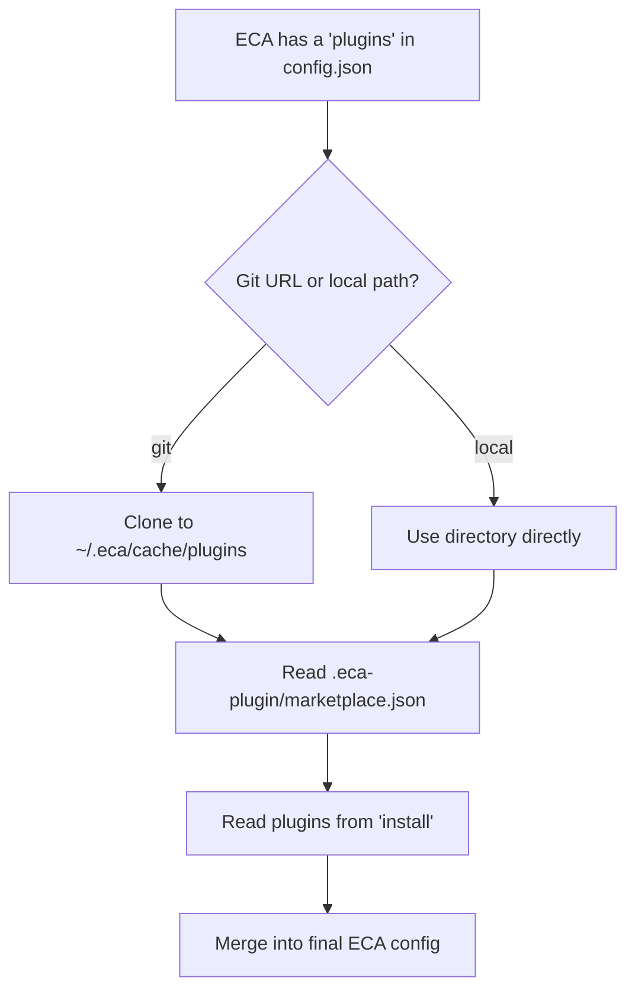

# Plugins / Marketplace

Plugins let you share and reuse ECA configuration across projects and teams. A plugin source is a git repository or local directory containing a **marketplace** of plugins, each providing any combination of skills, agents, commands, rules, hooks, MCP servers, and config overrides.

## Official Plugin Repository

ECA ships with built-in support for the **official plugin repository** at [plugins.eca.dev](https://plugins.eca.dev). This marketplace is pre-configured as the `"eca"` source, so you can install any of its plugins without adding a custom source — just list them in `install`:

```javascript title="~/.config/eca/config.json"
{
  "plugins": {
    "install": ["secret-guard", "tdd", "security-review"]
  }
}
```

Browse available plugins and their documentation at [plugins.eca.dev](https://plugins.eca.dev), or run `/plugins` inside ECA to see the full list.

Want to contribute a plugin? Check the [eca-plugins](https://github.com/editor-code-assistant/eca-plugins) repository on GitHub.

## How it works



1. You register one or more **sources** (git URL or local path) and list plugin names in **`install`**.
2. ECA resolves each source — cloning git repos to a local cache or using the local path directly.
3. Each source provides a **marketplace** (`.eca-plugin/marketplace.json`) listing its available plugins.
4. ECA matches `install` names against the marketplace, then **discovers components** from each matched plugin directory.
5. All components are **merged** into the config waterfall — user config always takes precedence on conflicts.

## Commands

### `/plugins`

Lists all available plugins from your configured marketplaces. Plugins that are already installed are marked with ✅.

```
/plugins
```

### `/plugin-install`

Installs a plugin by adding it to the `install` list in your global config.

```
/plugin-install <plugin-name>
/plugin-install <plugin-name@marketplace>
```

Use `<plugin-name@marketplace>` to disambiguate when multiple sources provide a plugin with the same name. After installing, restart ECA for the plugin to take effect.

## Pointing to a plugin source / marketplace

The official [plugins.eca.dev](https://plugins.eca.dev) marketplace is always available as the built-in `"eca"` source. To install plugins from it, just add their names to `install` — no source configuration needed.

To add **custom** sources (your organization's plugins, community repos, or local directories), add named entries under the `plugins` key:

=== "Official repository only"

    No source configuration required — just list the plugins you want:

    ```javascript title="~/.config/eca/config.json"
    {
      "plugins": {
        "install": ["tdd", "secret-guard"]
      }
    }
    ```

=== "Custom git source"

    ```javascript title="~/.config/eca/config.json"
    {
      "plugins": {
        "my-org": {
          "source": "https://github.com/my-org/eca-plugins.git"
        },
        "install": ["code-review", "security-scanner"]
      }
    }
    ```

=== "Local path (for development)"

    ```javascript title=".eca/config.json"
    {
      "plugins": {
        "local-dev": {
          "source": "/home/user/my-eca-plugins"
        },
        "install": ["my-plugin"]
      }
    }
    ```

=== "Multiple sources"

    ECA searches the built-in `"eca"` source plus all registered sources when resolving `install` entries:

    ```javascript title="~/.config/eca/config.json"
    {
      "plugins": {
        "company": {
          "source": "https://github.com/company/eca-plugins.git"
        },
        "community": {
          "source": "https://github.com/community/shared-plugins.git"
        },
        "install": ["company-standards", "linter-setup", "shared-skills"]
      }
    }
    ```

## Creating a plugin source (Plugins marketplace)

A plugin source is a directory (typically a git repo) with a `.eca-plugin/marketplace.json` file that lists available plugins.

### Marketplace file

```json title=".eca-plugin/marketplace.json"
{
  "plugins": [
    {
      "name": "code-review",
      "description": "Agents and skills for thorough code review",
      "source": "plugins/code-review"
    },
    {
      "name": "security-scanner",
      "description": "Security-focused rules and hooks",
      "source": "plugins/security-scanner"
    }
  ]
}
```

Each plugin entry has:

| Field | Description |
|-------|-------------|
| `name` | Unique plugin name (used in `install`) |
| `description` | Human-readable description |
| `source` | Relative path from the repo root to the plugin directory |

### Plugin directory structure

Each plugin directory can contain any combination of:

```
plugins/code-review/
├── skills/
│   └── review-checklist/
│       └── SKILL.md
├── agents/
│   └── reviewer.md
├── commands/
│   └── review.md
├── rules/
│   └── code-standards.md
├── hooks/
│   └── hooks.json
├── .mcp.json
└── eca.json
```

| Path | What it provides | Details |
|------|-----------------|---------|
| `skills/` | Skill definitions | Each subfolder follows the [agentskills.io](https://agentskills.io/) spec with a `SKILL.md` |
| `agents/*.md` | Agent definitions | Markdown files with YAML frontmatter, same format as local agents |
| `commands/*.md` | Custom commands | Markdown command files, same format as local commands |
| `rules/**` | Rule files | Any files under `rules/` are loaded as rules |
| `hooks/hooks.json` | Hooks | [ECA hook format](hooks.md) |
| `.mcp.json` | MCP server definitions | Standard `{"mcpServers": {...}}` format |
| `eca.json` | Config overrides | Arbitrary ECA config keys deep-merged into config |

All paths are optional — include only what your plugin needs.

=== "Skill-only plugin"

    ```
    plugins/gif-maker/
    └── skills/
        └── gif-generator/
            ├── SKILL.md
            └── scripts/
                └── generate.py
    ```

=== "Hooks + MCP plugin"

    ```
    plugins/security-scanner/
    ├── hooks/
    │   └── hooks.json
    └── .mcp.json
    ```

=== "Config overrides only"

    ```
    plugins/team-defaults/
    └── eca.json
    ```

=== "Full plugin"

    ```
    plugins/company-standards/
    ├── skills/
    │   └── internal-api/
    │       └── SKILL.md
    ├── agents/
    │   └── reviewer.md
    ├── commands/
    │   └── deploy.md
    ├── rules/
    │   └── coding-standards.md
    ├── hooks/
    │   └── hooks.json
    ├── .mcp.json
    └── eca.json
    ```
