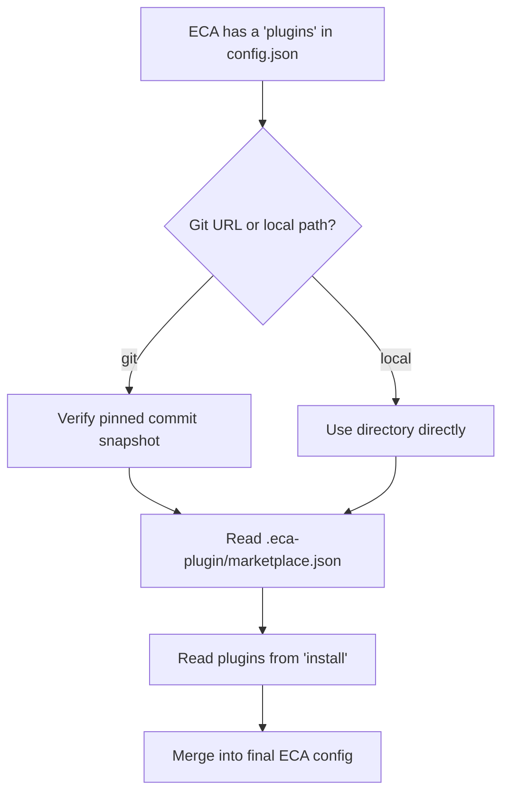

# Plugins / Marketplace

Plugins let you share and reuse ECA configuration across projects and teams. A plugin source is a git repository or local directory containing a **marketplace** of plugins, each providing any combination of skills, agents, commands, rules, hooks, MCP servers, and config overrides.

## Official Plugin Repository

ECA ships with built-in support for the **official plugin repository** at [plugins.eca.dev](https://plugins.eca.dev). This marketplace is pre-configured as the `"eca"` source, so you can install any of its plugins without adding a custom source — just list them in `install`:

```javascript title="~/.config/eca/config.json"
{
  "plugins": {
    "install": ["secret-guard", "tdd", "security-review"]
  }
}
```

Browse available plugins and their documentation at [plugins.eca.dev](https://plugins.eca.dev), or run `/plugins` inside ECA to see the full list.

Want to contribute a plugin? Check the [eca-plugins](https://github.com/editor-code-assistant/eca-plugins) repository on GitHub.

## How it works


```mermaid
flowchart TD
    A[ECA has a 'plugins' in config.json] --> B{Git URL or local path?}
    B -->|git| C[Verify pinned commit snapshot]
    B -->|local| D[Use directory directly]
    C --> E[Read .eca-plugin/marketplace.json]
    D --> E
    E --> F[Read plugins from 'install']
    F --> G[Merge into final ECA config]
```

1. You register one or more **sources** (git URL or local path) and list plugin names in **`install`**.
2. ECA resolves Git sources to **pinned commit snapshots**, or uses local development paths directly. Restarts and listing/installing plugins do not advance an existing pin.
3. Each source provides a **marketplace** (`.eca-plugin/marketplace.json`) listing its available plugins.
4. ECA resolves each `install` entry to one marketplace, expands its [**dependencies**](#plugin-dependencies) transitively, then **discovers components**. Ambiguous names must be qualified as `name@marketplace`.
5. Components are **merged** into the config waterfall, in install order (later plugins override earlier plugins). Plugin configuration merges after ordinary user/project files and before `extraConfigs`.

## Pinned Git versions

The first resolution pins a source's current commit. If an older ECA cache exists, ECA freezes that cache's commit **without pulling**, after checking its origin and clean working tree. Otherwise it downloads the source's default branch and pins its actual commit. This is trust on first use, not a security review or an additional approval prompt.

Pins live in `plugin-locks/<source-url-hash>.json` in ECA's global config directory. Detached snapshots live in `plugins/snapshots/<source-url-hash>/<commit>` in ECA's cache directory. Pins are shared by source URL across projects and marketplace aliases. All plugins, paths, and dependency declarations inside that source use the same snapshot; dependencies in other sources use those sources' pins.

Before reading a cached source, ECA verifies the actual commit and requires a clean snapshot, including no untracked or ignored files. Marketplace paths and filesystem symlinks must remain inside that snapshot and cannot point into `.git`; portable internal symlinks are supported. These checks do not restrict explicit external references inside `eca.json`.

Treat Git snapshots as read-only; use local sources for development and write generated files outside the snapshot. A mismatched commit, invalid pin, dirty cache, escaping path, or ambiguous plugin reference stops plugin resolution and displays an error in the editor instead of silently choosing another version or marketplace. Clearing cached snapshots does not clear the pins: ECA fetches the exact pinned commit again, or fails if it is unavailable.

Use [`/plugin-update <marketplace>`](#plugin-update) to advance a source explicitly. There are no automatic background updates. Loaded components keep using the old snapshot until you restart ECA.

Local directory sources remain **mutable and unpinned**. Pinning does not sandbox plugins: hooks, MCP servers, `${cmd:...}`, and arbitrary `eca.json` overrides still work as before. Only use sources you trust. External programs or downloads invoked by a plugin are not pinned by its Git snapshot.

## Install lists from multiple config sources

Normally, an array from a higher-priority [config source](introduction.md#merge-order) replaces the lower-priority one. Install lists are the exception: they combine. Your global config can hold your personal plugins while a project's `.eca/config.json` adds its own; an empty list `[]` simply adds nothing.

To make a source ignore what the others install, add `"installMode": "replace"` next to its `install` list:

```javascript title=".eca/config.json"
{
  "plugins": { "installMode": "replace", "install": ["my-plugin"] }
}
```

## Commands

### `/plugins`

Lists plugins from the pinned versions of your configured marketplaces, showing each Git commit (or that a local source is unpinned). Installed plugins are marked with ✅. Listing does not check for or activate newer versions.

```
/plugins
```

### `/plugin-install`

Installs a plugin by adding its qualified `name@marketplace` reference to the `install` list in your global config. Entries from project or other config sources are not copied into global config.

```
/plugin-install <plugin-name>
/plugin-install <plugin-name@marketplace>
```

Bare names work only when exactly one configured marketplace provides the plugin. Ambiguous names are rejected with the qualified choices; ECA never installs all matches. The selected marketplace is preserved even when you initially use a bare name. Existing ambiguous entries in configuration must also be qualified. After installing, restart ECA for the plugin to take effect.

If a newly published plugin is not present in the pinned marketplace, update that marketplace explicitly first. Installing another plugin does not silently update existing plugins from the same source.

If the plugin declares [dependencies](#plugin-dependencies), they are resolved and loaded automatically on startup; no need to install each one individually.

### `/plugin-update`

```
/plugin-update <marketplace>
```

For example, `/plugin-update eca` downloads the official marketplace's current default-branch commit, verifies a separate snapshot, and advances its pin. **This updates all plugins from that source, across projects**, not one individual plugin. The command reports the old and new commits. Restart ECA to activate the updated versions.

An update is an explicit decision to trust the new version; there is no additional activation prompt. A failed download, integrity check, or marketplace validation leaves the previous pin unchanged. Local directory sources cannot be updated with this command.

### `/plugin-uninstall`

```
/plugin-uninstall <plugin-name>
/plugin-uninstall <plugin-name@marketplace>
```

Removes the plugin's global install entry. A bare name can identify a unique qualified entry; ambiguous choices require the exact reference. If another config source installed the plugin, edit that source instead. Plugins that other installed plugins [depend on](#plugin-dependencies) stay loaded. Restart ECA to apply. Source pins and snapshots are retained, so reinstalling does not silently pick up a newer version.

## Pointing to a plugin source / marketplace

The official [plugins.eca.dev](https://plugins.eca.dev) marketplace is always available as the built-in `"eca"` source. To install plugins from it, just add their names to `install` — no source configuration needed.

To add **custom** sources (your organization's plugins, community repos, or local directories), add named entries under the `plugins` key:

=== "Official repository only"

    No source configuration required — just list the plugins you want:

    ```javascript title="~/.config/eca/config.json"
    {
      "plugins": {
        "install": ["tdd", "secret-guard"]
      }
    }
    ```

=== "Custom git source"

    ```javascript title="~/.config/eca/config.json"
    {
      "plugins": {
        "my-org": {
          "source": "https://github.com/my-org/eca-plugins.git"
        },
        "install": ["code-review", "security-scanner"]
      }
    }
    ```

=== "Local path (for development)"

    ```javascript title=".eca/config.json"
    {
      "plugins": {
        "local-dev": {
          "source": "/home/user/my-eca-plugins"
        },
        "install": ["my-plugin"]
      }
    }
    ```

=== "Multiple sources"

    ECA searches the built-in `"eca"` source plus all registered sources when resolving `install` entries:

    ```javascript title="~/.config/eca/config.json"
    {
      "plugins": {
        "company": {
          "source": "https://github.com/company/eca-plugins.git"
        },
        "community": {
          "source": "https://github.com/community/shared-plugins.git"
        },
        "install": ["company-standards", "linter-setup", "shared-skills"]
      }
    }
    ```

## Creating a plugin source (Plugins marketplace)

A plugin source is a directory (typically a git repo) with a `.eca-plugin/marketplace.json` file that lists available plugins.

### Marketplace file

```json title=".eca-plugin/marketplace.json"
{
  "plugins": [
    {
      "name": "code-review",
      "description": "Agents and skills for thorough code review",
      "source": "plugins/code-review"
    },
    {
      "name": "security-scanner",
      "description": "Security-focused rules and hooks",
      "source": "plugins/security-scanner"
    },
    {
      "name": "team-kit",
      "description": "Meta-plugin bundling the team's baseline plugins",
      "source": "plugins/team-kit",
      "dependencies": ["code-review", "security-scanner"]
    }
  ]
}
```

Each plugin entry has:

| Field | Description |
|-------|-------------|
| `name` | Unique plugin name (used in `install`) |
| `description` | Human-readable description |
| `source` | Relative path from the repo root to the plugin directory |
| `dependencies` | *(optional)* Plugin refs to load automatically with this plugin: `"name"` or `"name@marketplace"` |

### Plugin dependencies

A plugin can declare other plugins as **dependencies**, so installing it pulls the whole set along — useful for **meta-plugins** that bundle a curated plugin list behind a single install. Dependencies can be declared in the marketplace entry (as above) or in an optional `.eca-plugin/plugin.json` inside the plugin directory:

```json title="plugins/team-kit/.eca-plugin/plugin.json"
{
  "name": "team-kit",
  "dependencies": ["code-review", "security-scanner@community"]
}
```

- Each ref is `"name"` (must match exactly one configured source) or `"name@marketplace"` (only the named source). Ambiguous dependencies stop resolution before component discovery.
- Dependencies are resolved **transitively at startup** from pinned source snapshots and are **not persisted** to your `install` list: uninstalling the plugin stops its dependencies from loading too. Updating one marketplace does not advance other marketplaces' pins.
- Shared dependencies and cycles are resolved once; unknown dependencies or marketplaces log a warning without blocking the remaining plugins.
- Merge order: dependencies are merged before the plugins that depend on them, and directly installed plugins are merged last — explicit installs win config conflicts.

### Plugin directory structure

Each plugin directory can contain any combination of:

```
plugins/code-review/
├── skills/
│   └── review-checklist/
│       └── SKILL.md
├── agents/
│   └── reviewer.md
├── commands/
│   └── review.md
├── rules/
│   └── code-standards.md
├── hooks/
│   └── hooks.json
├── .mcp.json
└── eca.json
```

| Path | What it provides | Details |
|------|-----------------|---------|
| `skills/` | Skill definitions | Each subfolder follows the [agentskills.io](https://agentskills.io/) spec with a `SKILL.md` |
| `agents/*.md` | Agent definitions | Markdown files with YAML frontmatter, same format as local agents |
| `commands/*.md` | Custom commands | Markdown command files, same format as local commands |
| `rules/**` | Rule files | Any files under `rules/` are loaded as rules |
| `hooks/hooks.json` | Hooks | [ECA hook format](hooks.md) |
| `.mcp.json` | MCP server definitions | Standard `{"mcpServers": {...}}` format |
| `eca.json` | Config overrides | Arbitrary ECA config keys deep-merged into config |
| `.eca-plugin/plugin.json` | Plugin manifest | Optional; may declare [`dependencies`](#plugin-dependencies) |

All paths are optional — include only what your plugin needs.

### User-invocation naming: plugin prefix

Commands and skills provided by a plugin are exposed to the user under a `<plugin-name>:<name>` namespace. This avoids collisions between plugins and makes it obvious which plugin a command or skill comes from.

- A command `deploy.md` inside plugin `ui-doomer` is invoked as `/ui-doomer:deploy`.
- A skill named `button` inside plugin `ui-doomer` is invoked as `/ui-doomer:button`.
- When the plugin name equals the command or skill name, the prefix is dropped: a skill named `ui-doomer` inside plugin `ui-doomer` is just `/ui-doomer` (not `/ui-doomer:ui-doomer`).
- User-local and user-global commands/skills (from `~/.config/eca/commands/` or `.eca/commands/`) are not prefixed.

If a plugin's prefixed command name happens to collide with an MCP prompt of the form `server:prompt`, the plugin command takes precedence.

=== "Skill-only plugin"

    ```
    plugins/gif-maker/
    └── skills/
        └── gif-generator/
            ├── SKILL.md
            └── scripts/
                └── generate.py
    ```

=== "Hooks + MCP plugin"

    ```
    plugins/security-scanner/
    ├── hooks/
    │   └── hooks.json
    └── .mcp.json
    ```

=== "Config overrides only"

    ```
    plugins/team-defaults/
    └── eca.json
    ```

=== "Full plugin"

    ```
    plugins/company-standards/
    ├── skills/
    │   └── internal-api/
    │       └── SKILL.md
    ├── agents/
    │   └── reviewer.md
    ├── commands/
    │   └── deploy.md
    ├── rules/
    │   └── coding-standards.md
    ├── hooks/
    │   └── hooks.json
    ├── .mcp.json
    └── eca.json
    ```
